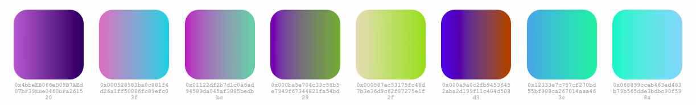

# Ethereum Gradient Base64

A tiny library for generating gradient identicons as base64 encoded PNGs.



[**See a live demo of it in action**](https://afa7789.github.io/ethereum-gradient-base64/)

## Install

```
# NPM
npm install --save ethereum-gradient-base64

# Yarn
yarn add ethereum-gradient-base64
```

## Use

### Vanilla JS

```javascript
import makeBlockie from 'ethereum-gradient-base64';

const img = new Image() ;
img.src = makeGradient('0x7cB57B5A97eAbe94205C07890BE4c1aD31E486A8');

document.body.appendChild(img);
```

### React

```javascript
import React from 'react';
import makeGradient from 'ethereum-gradient-base64';

class Gradient extends React.Component {
  render() {
    return 
  }
}
```

Note: In a real setting, we recommend saving to state and re-making the gradient on prop change for better re-render performance.


License
-------

[MIT](https://opensource.org/licenses/MIT)
